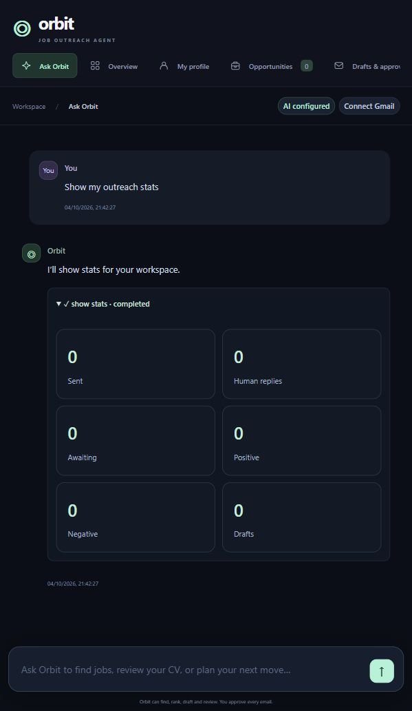

# Orbit

A standalone conversational job-search and Gmail outreach agent. Friends do not need Codex or ChatGPT Plus. AI features need their own funded OpenAI API account, and Gmail needs OAuth authorization.

## Features

- Dark responsive interface, smooth transitions, reduced-motion support and a prompt bar throughout the workspace.
- Saved conversations, background tasks and receipts showing completed actions or failures.
- CV/resume/portfolio text import: TXT, MD, DOCX and selectable-text PDF.
- Live job discovery, evidence, fit scores, gap analysis, duplicate filtering and sorting.
- Daily discovery with timezone, time and volume controls, persisted attempts and no repeated paid retry loop.
- Gmail drafts and chosen attachments; sending requires approval of exact draft contents. Remote edits invalidate approval.
- Daily send caps, suppression, duplicate prevention and reconciliation of uncertain sends.
- Reviewable reply categories and improvement suggestions grounded in materials, listing requirements and employer feedback.
- Hosted sign-in, isolated workspaces, encrypted API/OAuth credentials, CSRF protection, invite-code registration and workspace export.

## Run locally

Install Node.js 24 or newer. In this folder run:

```sh
npm install
npm start
```

Open http://127.0.0.1:8765. Windows users can use Start.cmd. Local mode binds to loopback and needs no Orbit login. In Settings save your own API key and choose a model; changes take effect immediately. API usage is separately billed and is not included in ChatGPT subscriptions.

Save your profile and upload application materials. Enable Gmail API in a Google Cloud project, configure its OAuth audience/test users, create a Desktop app OAuth client, download its JSON, upload it in Settings and connect Gmail.

## Conversational workflow

Try `Find relevant jobs`, `Rank my jobs by fit`, `Review my resume`, `Check my replies`, `Pause daily discovery`, or `Show my outreach stats`. Simple exact commands avoid a planner API call. Flexible instructions use AI planning with at most five supported actions per turn. Draft requests allow at most three known jobs with confirmed contacts. The planner cannot send/approve emails, execute code or change credentials.

Review listing evidence and confirm a published recruiting contact and source URL. Generate a draft, save edits, review and approve its exact contents, then select approved drafts and use the send control. Correct reply classifications and suppress recipients when appropriate.

Daily discovery defaults to 09:00 Asia/Kolkata and 20 requested roles. Keep the server running. After startup it makes one catch-up attempt for today, rather than backfilling missed days. Results can be fewer than requested. The AI call budget defaults to 50 attempts/account/day including failures (AI_DAILY_CALL_LIMIT). Sending defaults to 20/day, configurable up to 100; Gmail can impose additional limits. Sending never happens automatically.

Human reply totals count each outreach record once. Multiple replies do not inflate response rates. Silence remains awaiting rather than rejected; automatic replies and bounces are separate. Unrelated Gmail threads may need manual review. Recommendations distinguish employer feedback, listing requirements and hypotheses. Hiring success and accurate classification are not guaranteed.

## Hosted deployment

See [DEPLOYMENT.md](DEPLOYMENT.md). Dockerfile and render.yaml target Render Free, encrypted private Supabase Storage, and scheduled GitHub Actions. Render supplies a project-named onrender.com address without ChatGPT in the URL. Hosting uses free tiers with cold starts, quotas and best-effort scheduling; no paid resources are provisioned.

Hosted mode requires HTTPS APP_URL, durable cloud storage or persistent JOB_AGENT_DATA and a stable 64-character hexadecimal VAULT_KEY. It binds to 0.0.0.0 and requires sign-in. Set SIGNUP_CODE for a controlled launch. Users supply their own API keys; hosted accounts never inherit the server key. Hosted Gmail uses a Web application OAuth client with the exact APP_URL/oauth/callback redirect. Broad distribution may require Google OAuth verification.

## Data and privacy

Passwords use salted scrypt hashes. API keys and Gmail tokens are AES-256-GCM encrypted. Application content is stored as plain JSON/files; protect disk access and backups. The operator controls the vault key and can access data. This implementation supports one server process, not distributed writes.

AI tasks send relevant materials/messages to the user's OpenAI project. Gmail scopes are gmail.readonly and gmail.compose; the app reads tracked threads and searches Sent for reconciliation. Agent sessions are deleted after tasks when possible; cleanup failures are recorded. Provider retention policies apply.

Export in Settings and disconnect Gmail to revoke access. Account deletion and password recovery require operator support. Publish operator identity/contact in the privacy notice before broad launch. Never commit/distribute .env.local, data/, tokens, documents or email history. See [SECURITY.md](SECURITY.md).

## Verification

Run `npm test`: 28 checks cover approvals, duplicate sends, MIME, scheduling, mocked Gmail, conversational actions, authentication, account isolation, encrypted credentials and atomic cloud snapshots. See [VERIFICATION.md](VERIFICATION.md). `npm run check-access` performs a bounded paid agent check.

Successful live AI tasks and a real Gmail send/reply cycle remain unverified pending funded API access and a connected mailbox. This package is a controlled-launch implementation, not a claim of production certification.

## Structure

server.mjs serves the UI/API; chat.mjs validates plans; agent.mjs calls hosted agents; service.mjs implements outreach; gmail.mjs handles OAuth/Gmail; scheduler.mjs handles discovery; workspace.mjs, auth.mjs and store.mjs manage account data. Browser code is in public/ and checks in test/.

Official references: [Agents API](https://developers.openai.com/api/docs/guides/agents-api/quickstart), [Gmail drafts](https://developers.google.com/workspace/gmail/api/guides/drafts), [Google OAuth](https://developers.google.com/identity/protocols/oauth2/web-server), [Render disks](https://render.com/docs/disks).


## Interface


