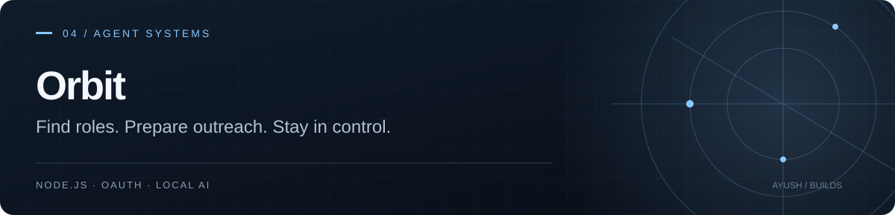

# Orbit
### A workspace for finding roles and preparing outreach.

[Open the hosted preview](https://orbit-job-agent.onrender.com) · Invitation required · [Local AI setup](LOCAL_AI.md)

Orbit brings job discovery, application materials, drafts, and reply tracking into one conversational interface. Sending a message requires approval of its exact contents.

**Node.js 24+ · Gmail OAuth · Ollama / optional hosted AI**


## Workflow

1. Add your profile and import application materials.
2. Discover roles and review their sources, fit estimates, and gaps.
3. Confirm a recruiting contact and prepare a draft.
4. Review the text and attachments, approve, then send.
5. Review replies and correct their classifications where needed.

The planner cannot approve or send emails. Editing a draft invalidates its approval. Duplicate checks, suppression, send limits, and uncertain-send reconciliation help keep outreach reviewable.

## Run locally

```sh
git clone https://github.com/AyushKJha/orbit-job-agent.git
cd orbit-job-agent
npm install
npm start
```

Use Node.js 24+ and open http://127.0.0.1:8765. Windows users can run `Start.cmd`.

Choose [local AI](LOCAL_AI.md) or configure your own funded provider access. Gmail features require a Google Cloud OAuth client and explicit mailbox authorization. See [configuration and workflow details](OPERATIONS.md).

## What is included

- Saved conversations, background tasks, and action receipts.
- TXT, Markdown, DOCX, and selectable-text PDF imports.
- Discovery schedules with time zone and volume controls.
- Evidence-linked listings, fit estimates, and duplicate filtering.
- Gmail drafts, attachments, reply categories, and workspace exports.
- Invitation-based hosted accounts with isolated workspaces.

## Deployment and data

[DEPLOYMENT.md](DEPLOYMENT.md) covers hosting, durable storage, and configuration. A free hosted service may sleep; scheduling is best effort.

Credentials are encrypted, while application materials are stored as plain files/JSON protected by the operator's storage access. The operator can access hosted data. Review [SECURITY.md](SECURITY.md) and the existing privacy notice before connecting a mailbox.

## Checks and current status

```sh
npm test
```

See [VERIFICATION.md](VERIFICATION.md) for scope. Mocked tests cover approval rules, scheduling, account isolation, and Gmail behavior. A successful end-to-end live AI and Gmail send/reply cycle remains unverified in the project documentation. The hosted version is a controlled preview.

## Source map

[server.mjs](server.mjs) serves the app; [chat.mjs](chat.mjs) validates plans; [service.mjs](service.mjs) handles outreach; [gmail.mjs](gmail.mjs) integrates Gmail. The UI lives in [public/](public/) and checks in [test/](test/).

[MIT license](LICENSE)
